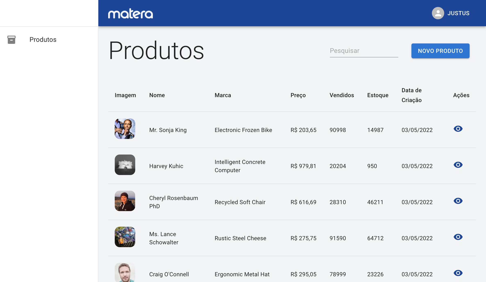

# CRUD de produtos

    

A simple products CRUD. ([See live](https://matera-crud.vercel.app))

## 🚀 How to run

1. Open project folder and run `yarn` to install all dependencies;
2. Run `yarn start` to start the app.
